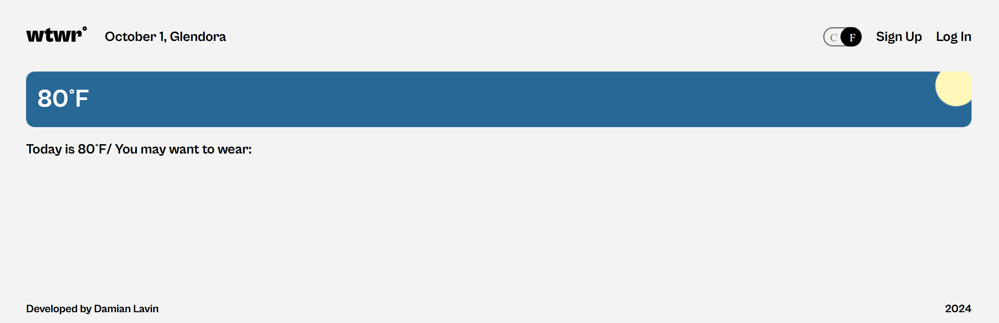

# What to Wear(WTWR)

## Tech Stack

  
  
  
  
  
  
  

## Description

'What to Wear' is a digital closet application where a user can sort through clothing cards depending on what the temperature is.

**Some features include:**

- Creating an account
- Change display temperature unit
- Add clothing cards
- Like a card or unlike a card
- Delete a card
- Two display modes, home view and the profile view

**Home View**

- Clothing cards are sorted to display based on the temperature
- New users can like previous users clothing cards on display after logout

**Profile View**

- Displays all clothing cards in the database that the user has created
- Edit profile picture or profile name

## Figma Design

Design for the whole application. [WTWR_Design](https://www.figma.com/design/bfVOvqlLmoKZ5lpro8WWBe/Sprint-14_-WTWR?node-id=0-1&p=f&t=ECfNwaaTAeghZ06c-0)

- Link to the backend of this project:
  [here](https://github.com/BlazinSamurai/se_project_express.git)

## Images of Application

**Home View, No user signed In**

