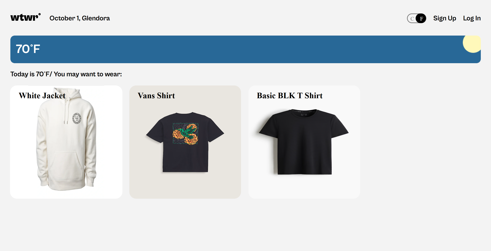

# What to Wear(WTWR)

## Tech Stack

  
  
  
  
  
  
  

## Back End

- Link to the backend of this project: [here](https://github.com/BlazinSamurai/se_project_express.git)

## Description

'What to Wear' is a digital closet application where a user can sort through clothing cards depending on what the temperature is.

**Some features include:**

- Creating an account
- Change display temperature unit
- Add clothing cards
- Like a card or unlike a card
- Delete a card
- Two display modes, home view and the profile view

**Home View**

- Clothing cards are sorted to display based on the temperature
- New users can like previous users clothing cards on display after logout

**Profile View**

- Displays all clothing cards in the database that the user has created
- Edit profile picture or profile name

## Figma Design

Design for the whole application. [WTWR_Design](https://www.figma.com/design/bfVOvqlLmoKZ5lpro8WWBe/Sprint-14_-WTWR?node-id=0-1&p=f&t=ECfNwaaTAeghZ06c-0)

## Future Additions

- Could implement user's to determine their own "hot","cold", and "warm" temperatures.
- Allow user's to upload images from gallery or other areas where images are stored instead of only allowing a url.
- Allow user's to upload multiple images of one item, for different views.
- Allow user's to pair items to include "completed outfits" instead of having individual items.
  - Or create scrollable sections for tops and bottoms so users can choose which items match best with each other.
- Maybe allow user's to "send" items to another user.

## Images of Application

**Home View, No user signed In**

**Sign Up Modal**

**Login Modal**

**New User View**

**New User Profile View**

**Editing Profile Information**

**Adding A Clothing Card**

**Profile View With Clothing Cards**

**Clothing Card Preview**

**Delete Confirmation Modal**

**Home View when User logs out**

**Home View with previous user card on display**

- The important thing to note here is that the clothing cards on display were the previous user's clothing cards. The current user can view them, preview them, and like them and if the user goes to their profile view the cards that were on display in the home view will not appear in their profile view. The current user cannot delete the cards either, the red delete button doesn't render, as shown below.
  
  
